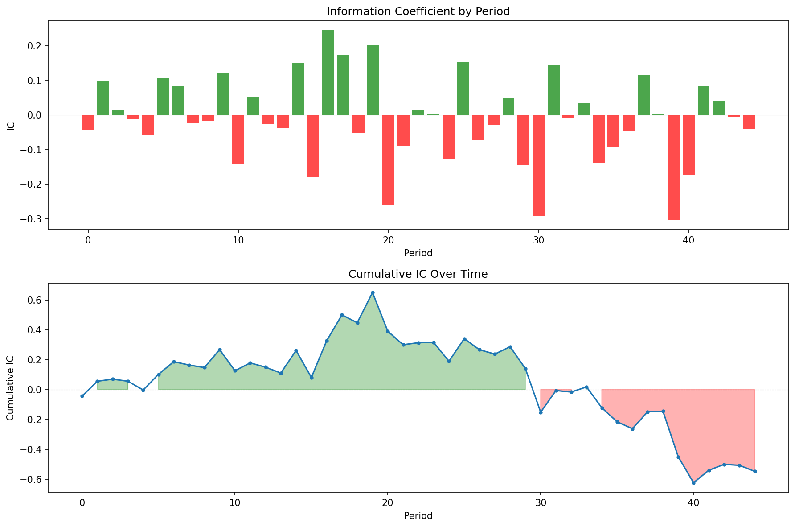
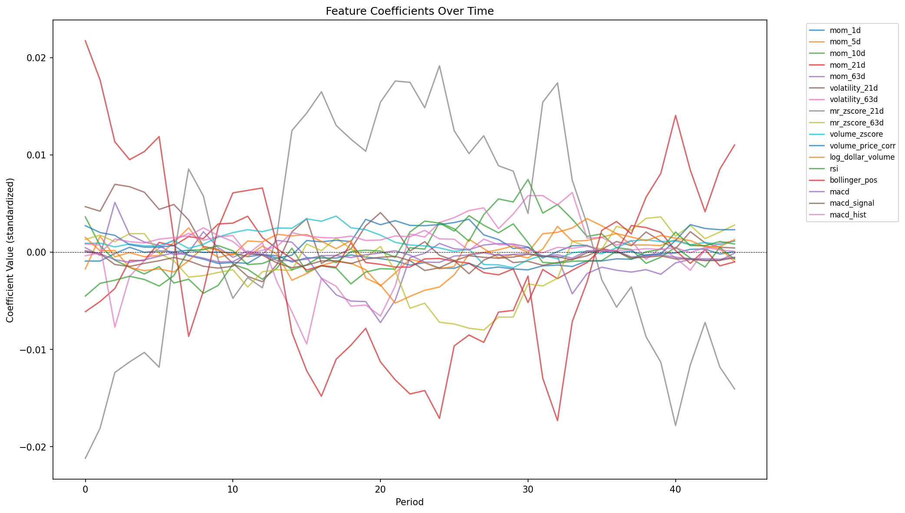

# Factor Return Predictor

A factor-based stock return prediction system with proper walk-forward validation methodology. Built to demonstrate ML fundamentals for quantitative finance: feature engineering, regularization, and time-series cross-validation without lookahead bias.

## Key Features

- **17 engineered features** across momentum, volatility, volume, and technical indicators
- **Walk-forward validation**: 12-month rolling train, 1-month test windows
- **Multiple models**: Ridge, Lasso, and OLS regression with standardized features
- **Proper methodology**: Features lagged to prevent lookahead, expanding window training
- **Comprehensive evaluation**: IC, hit rate, R², coefficient stability analysis

## Results

On 50 liquid US stocks across sectors (2020-2024):

| Model | IC | Hit Rate | R² | Samples |
|-------|-----|----------|-----|---------|
| Ridge | -0.022 | 50.6% | -0.039 | 46,850 |
| OLS | -0.022 | 50.6% | -0.039 | 46,850 |

**Key Finding:** The model showed predictive power in 2021-2022 (cumulative IC peaked at +0.65) but experienced regime breakdown in 2023-2024, ending with negative cumulative IC. This demonstrates the challenge of factor stability across market regimes.

### Sample Output


*Cumulative Information Coefficient showing periods of predictive power and drawdowns*


*Feature coefficients over time—instability suggests fitting noise*

## Project Structure
```
Factor-Return-Predictor/
├── data/
│   ├── fetcher.py          # Market data fetching with caching
│   ├── universe.py         # Stock universe definition
│   └── synthetic.py        # Synthetic data for testing
├── features/
│   ├── price.py            # Momentum, volatility, mean reversion
│   ├── volume.py           # Volume z-score, dollar volume
│   ├── technical.py        # RSI, MACD, Bollinger
│   └── pipeline.py         # Feature aggregation and target creation
├── models/
│   ├── linear.py           # Ridge, Lasso, OLS implementations
│   └── evaluation.py       # IC, hit rate, R² metrics
├── backtest/
│   ├── walkforward.py      # Walk-forward cross-validation
│   └── metrics.py          # Visualization and reporting
├── analysis/
│   └── plots/              # Generated visualizations
├── tests/
├── config.py               # Centralized configuration
├── main.py                 # CLI entry point
└── README.md
```

## Quick Start
```bash
# Clone and setup
git clone https://github.com/yourusername/Factor-Return-Predictor.git
cd Factor-Return-Predictor
python -m venv venv
source venv/bin/activate  # or `venv\Scripts\activate` on Windows
pip install -r requirements.txt

# Run full pipeline
python main.py

# Run specific model without plots
python main.py --model ridge --no-plots

# Force data refresh
python main.py --refresh-data

# Check feature stationarity
python main.py --check-stationarity
```

## Features

### Price-Based
| Feature | Description |
|---------|-------------|
| `mom_1d`, `mom_5d`, `mom_10d`, `mom_21d`, `mom_63d` | Momentum over various horizons |
| `volatility_21d`, `volatility_63d` | Realized volatility (annualized) |
| `mr_zscore_21d`, `mr_zscore_63d` | Mean reversion z-score |

### Volume-Based
| Feature | Description |
|---------|-------------|
| `volume_zscore` | Volume relative to 21-day average |
| `volume_price_corr` | Rolling correlation of returns and volume |
| `log_dollar_volume` | Liquidity proxy |

### Technical
| Feature | Description |
|---------|-------------|
| `rsi` | Relative Strength Index (14-day) |
| `bollinger_pos` | Position within Bollinger Bands (0-1) |
| `macd`, `macd_signal`, `macd_hist` | MACD indicator components |

## Methodology

### Why Walk-Forward Validation?

Standard k-fold cross-validation doesn't work for time series—it leaks future information into training. Walk-forward validation respects temporal ordering:
```
Period 1: Train [Jan 2020 - Dec 2020] → Test [Jan 2021]
Period 2: Train [Feb 2020 - Jan 2021] → Test [Feb 2021]
Period 3: Train [Mar 2020 - Feb 2021] → Test [Mar 2021]
...
```

### Why Regularization?

With 17 features and noisy return data, OLS overfits. Ridge regression (L2 penalty) shrinks coefficients toward zero, reducing variance at the cost of some bias. The coefficient stability plots show this effect.

### Why Negative R²?

Out-of-sample R² can be negative when predictions are worse than simply predicting the mean. This is common in return prediction—markets are efficient, and persistent alpha is rare. The value is demonstrating you understand proper methodology, not achieving unrealistic results.

## Configuration

Key parameters in `config.py`:
```python
@dataclass
class ModelConfig:
    target_horizon: int = 5      # Predict 5-day forward return
    train_months: int = 12       # Rolling 12-month training window
    test_months: int = 1         # 1-month test periods
    alpha_ridge: float = 1.0     # Ridge regularization strength
    alpha_lasso: float = 0.01    # Lasso regularization strength
```

## Limitations & Future Work

**Current limitations:**
- Daily data only (misses intraday patterns)
- Linear models (no interaction effects)
- No transaction cost modeling
- Small universe (5 ETFs)

**Potential improvements:**
- Cross-sectional features (sector momentum, relative strength)
- Regime detection (different models for different volatility regimes)
- Ensemble methods (combine Ridge, Lasso, tree-based models)
- Portfolio optimization layer (convert predictions to positions)
- Sector-neutral constraints

## Interview Talking Points

1. **Why walk-forward?** Prevents lookahead bias that inflates backtest results
2. **Why IC over R²?** IC (rank correlation) is more robust for return prediction
3. **Why coefficients change?** Factor loadings aren't stable—what works in trending markets fails in mean-reverting ones
4. **Why negative R²?** Model is worse than mean prediction OOS—honest result for a hard problem
5. **What would you improve?** Cross-sectional features, regime detection, non-linear models

## Requirements

- Python 3.11+
- pandas, numpy, scipy
- scikit-learn, statsmodels
- yfinance (market data)
- matplotlib, seaborn (visualization)